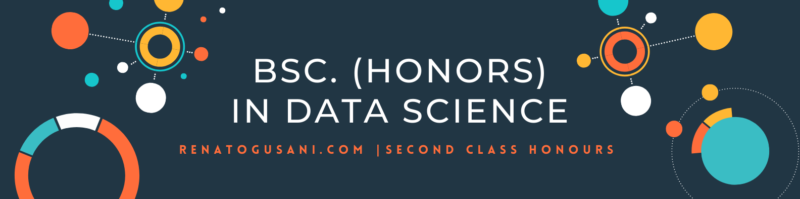

<!-- PROJECT LOGO -->
 

  

  <h3 align="center">Bsc. (Honours) in Data Science | NCI</h3>

   

      
     <a href="https://github.com/renatogusani/Bsc.-Data-Science"><strong>Explore the docs »</strong></a>
      
      
     <a href="http://renatogusani.github.io">View Site</a>
     ·
     <a href="https://github.com/renatogusani/Bsc.-Data-Science">Report Bug</a>
     ·
     <a href="https://github.com/renatogusani/Bsc.-Data-Science">Request Feature</a>
   

 

  

  

  

## Courses - Semester Schedules
Stage 1 / Semester 1
- Computational Thinking - [`H6CMPTHNK`](http://courses.ncirl.ie/index.cfm/page/module/moduleId/67603)
- Discrete Mathematics - `H6DISMTHS`
- Introduction to Data Science - `H6IDS`
- Problem Solving and Programming Concepts - `H6PSPC`
- The Computing Industry - `H6TCI`

Stage 1 / Semester 2
- Computing Systems - `H6COMPSYS`
- Data Visualisation - `H6IDMD`
- Introduction to Data Modelling and Databases - `H6PROG1`
- Programming I - `H6STATS1`

Year 2 - Semester 1
- Computational Thinking - `H6CMPTHNK`
- Discrete Mathematics - `H6DISMTHS`
- Introduction to Data Science - `H6IDS`
- Problem Solving and Programming Concepts - `H6PSPC`
- The Computing Industry - `H6TCI`

Year 2 - Semester 2
- Computational Thinking - `H6CMPTHNK`
- Discrete Mathematics - `H6DISMTHS`
- Introduction to Data Science - `H6IDS`
- Problem Solving and Programming Concepts - `H6PSPC`
- The Computing Industry - `H6TCI`

Year 1 - Semester 1
- Computational Thinking - `H6CMPTHNK`
- Discrete Mathematics - `H6DISMTHS`
- Introduction to Data Science - `H6IDS`
- Problem Solving and Programming Concepts - `H6PSPC`
- The Computing Industry - `H6TCI`

Year 3 - Semester 1
- Computational Thinking - `H6CMPTHNK`
- Discrete Mathematics - `H6DISMTHS`
- Introduction to Data Science - `H6IDS`
- Problem Solving and Programming Concepts - `H6PSPC`
- The Computing Industry - `H6TCI`

Year 3 - Semester 2
- Computational Thinking - `H6CMPTHNK`
- Discrete Mathematics - `H6DISMTHS`
- Introduction to Data Science - `H6IDS`
- Problem Solving and Programming Concepts - `H6PSPC`
- The Computing Industry - `H6TCI`

Year 4 - Semester 1
- Computational Thinking - `H6CMPTHNK`
- Discrete Mathematics - `H6DISMTHS`
- Introduction to Data Science - `H6IDS`
- Problem Solving and Programming Concepts - `H6PSPC`
- The Computing Industry - `H6TCI`

Year 4 - Semester 2
- Computational Thinking - `H6CMPTHNK`
- Discrete Mathematics - `H6DISMTHS`
- Introduction to Data Science - `H6IDS`
- Problem Solving and Programming Concepts - `H6PSPC`
- The Computing Industry - `H6TCI`
